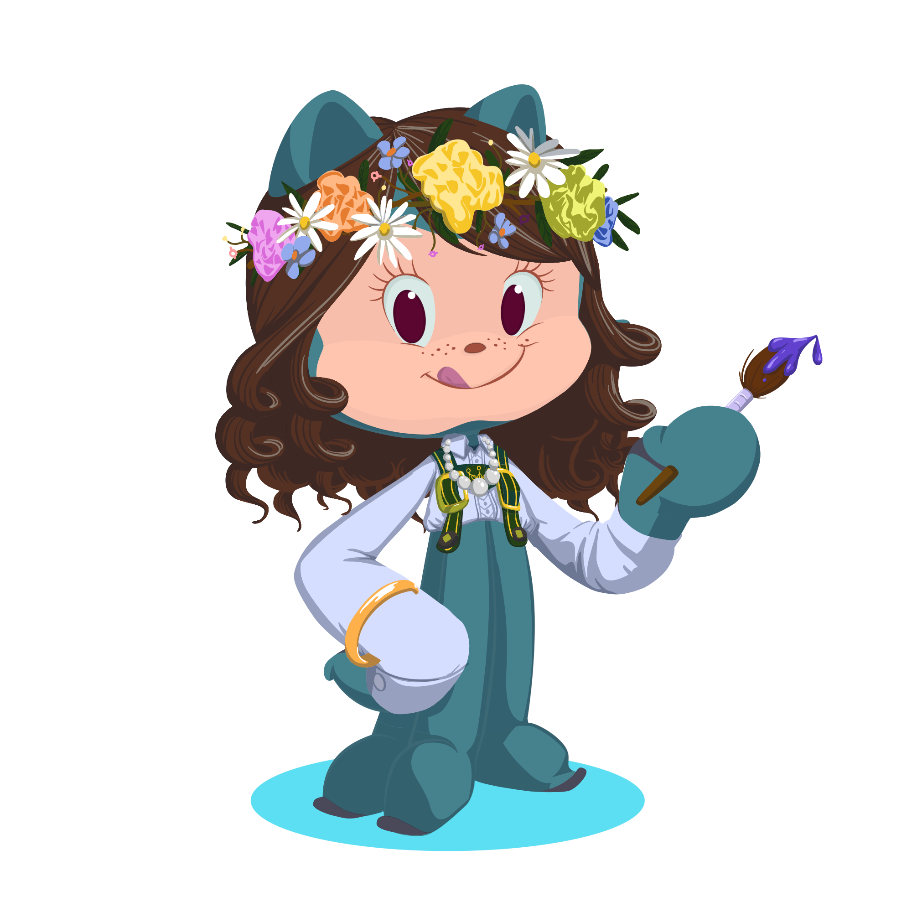

<!-- Home Banner -->
<h1 align="center">
  
</h1>

  

---
<!-- Introduction Section -->
✨ Welcome to my GitHub Profile! ✨  
I’m passionate about technology, software engineering, and design with the purpose of improving accessibility for its users.  
Always learning, always building! 🚀  

   

---
<!-- About me Section -->
## 🌸 About Me
- 🎓 Graduated from the Inter American University of Puerto Rico with a Bachelor's Degree in Computer Science  
- 💡 Interested in **UX/UI Design, Web Development, Software Engineering, and Front-End Development**  
- 📚 Currently working on my Master's Degree in Business Administration and personal projects  
- 🌱 Always eager to learn new technologies and skills! 

---
<!-- Technologies and Skills Section -->
## ⚡ Technologies & Skills

### Programming Languages  

### Frameworks & Tools  

### Databases and Cloud

### Other  

<!-- Soft Skills Section -->
### Soft Skills
💠 Team collaboration · Effective communication · Analytical · Responsible · Adaptive learner · Respectful · Public speaking · Creative · Innovative · Negotiation · Leadership · Reliable · Motivated · Ambitious · Problem-solving · Detail-oriented 💠

### Languages

---
<!-- Stats and Activities Section -->
## 📊 Activity

---
<!-- Portfolio Section -->
## ✒️ Portfolio

  <h3>
    Check out my portfolio!
    <a href="https://lvctech.github.io/My_Portfolio/" target="_blank">
      🔗https://lvctech.github.io/My_Portfolio/🔗
    </a>
  </h3>

---
<!-- Contribution Snake Section -->
## 🐍 My Contribution Snake  
 

  

---
<!-- Contact Section -->
## 🌐 Contact Me

  
  
  

  

  

